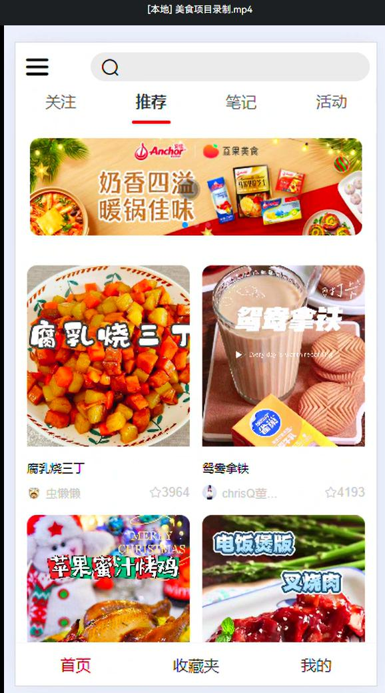
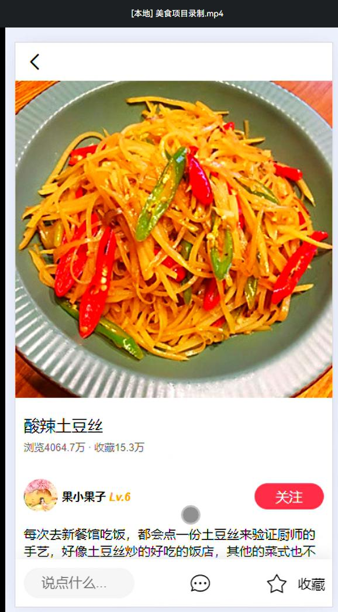
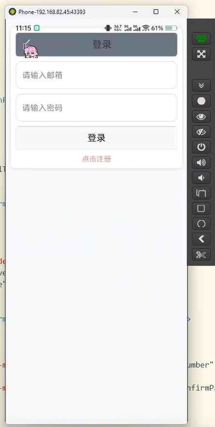
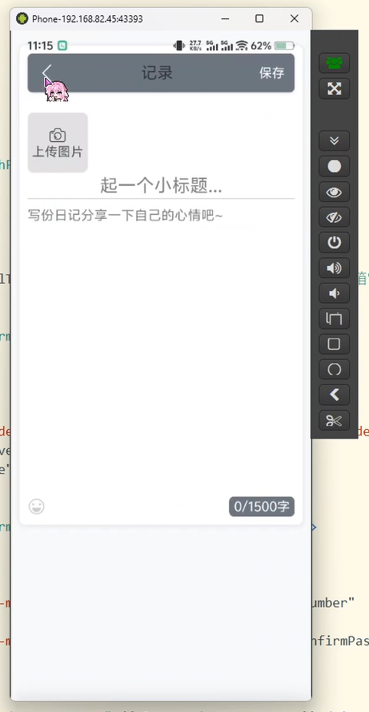
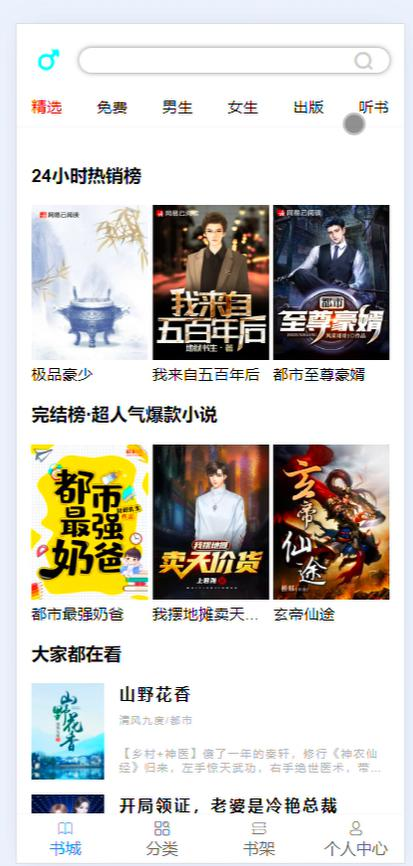
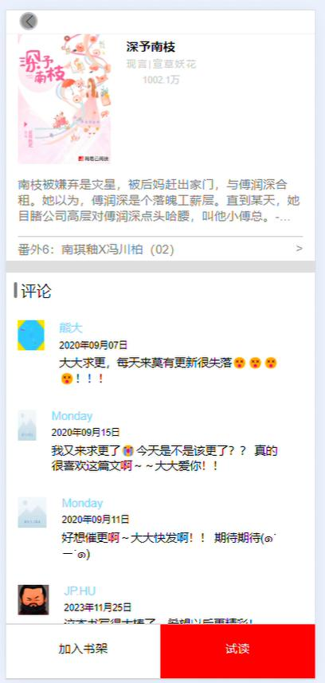
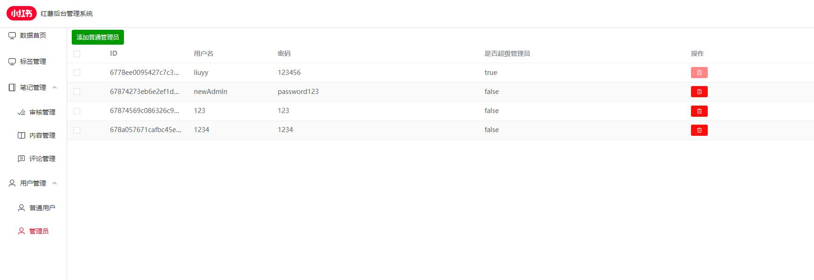
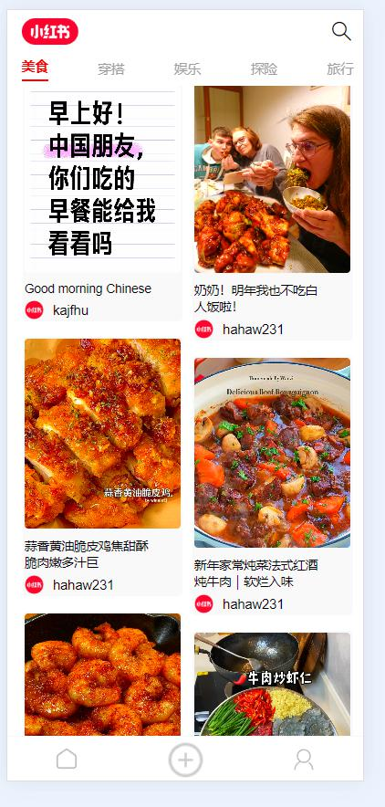

# 项目展示

这是一个包含多个前端项目的展示仓库，包括各种类型的应用界面设计和功能实现。

## 📱 项目预览

### 美食应用
展示美食相关的应用界面设计，包括首页、详情页、搜索等功能。




### 日记应用  
个人日记管理应用，具有登录、写日记、日历等功能。




### 阅读应用
在线阅读平台，包含书城、书架、阅读界面等。




### 社交应用后台系统
后台管理系统界面，包含用户管理、内容管理等功能。




## 🌐 在线演示

在vue文件夹中有一个图片文件夹，可以通过以下链接查看运行效果：

- [美食应用展示](https://hbinlris.github.io/vue/图片/DeliciousFood.html)
- [日记应用展示](https://hbinlris.github.io/vue/图片/diary.html)  
- [阅读应用展示](https://hbinlris.github.io/vue/图片/reading.html)
- [后台系统展示](https://hbinlris.github.io/vue/图片/backend.html)

## 🛠️ 技术栈

- HTML5
- CSS3
- JavaScript
- Vue.js
- 响应式设计

## 📄 项目结构

```
├── vue/
│   ├── 图片/
│   │   ├── 美食图片/
│   │   ├── 日记app/
│   │   ├── 阅读图片/
│   │   └── 社交app后台系统图片/
│   ├── 美食/
│   ├── 阅读/
│   └── 音乐/
├── html/
├── bootstrap/
└── domo/
```

